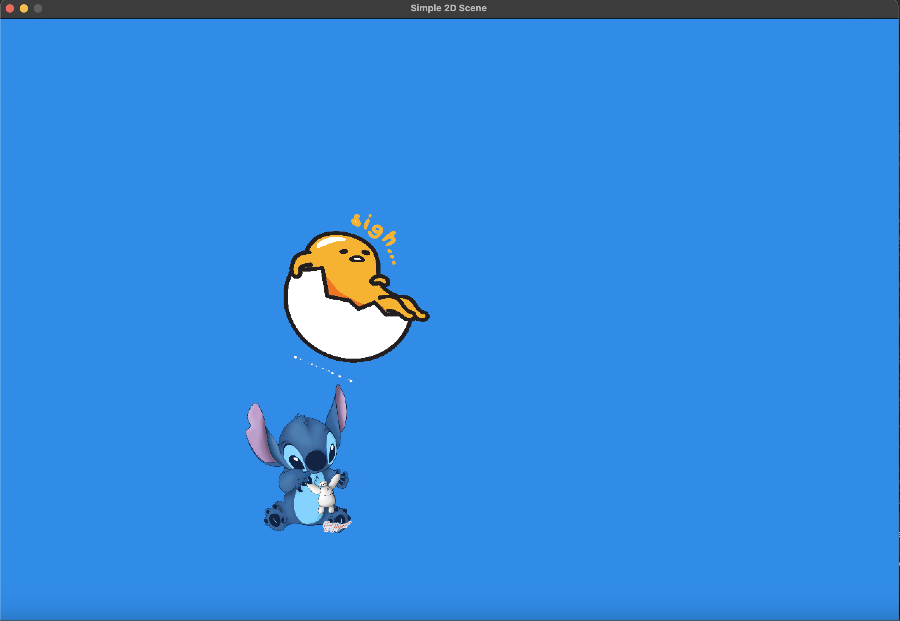
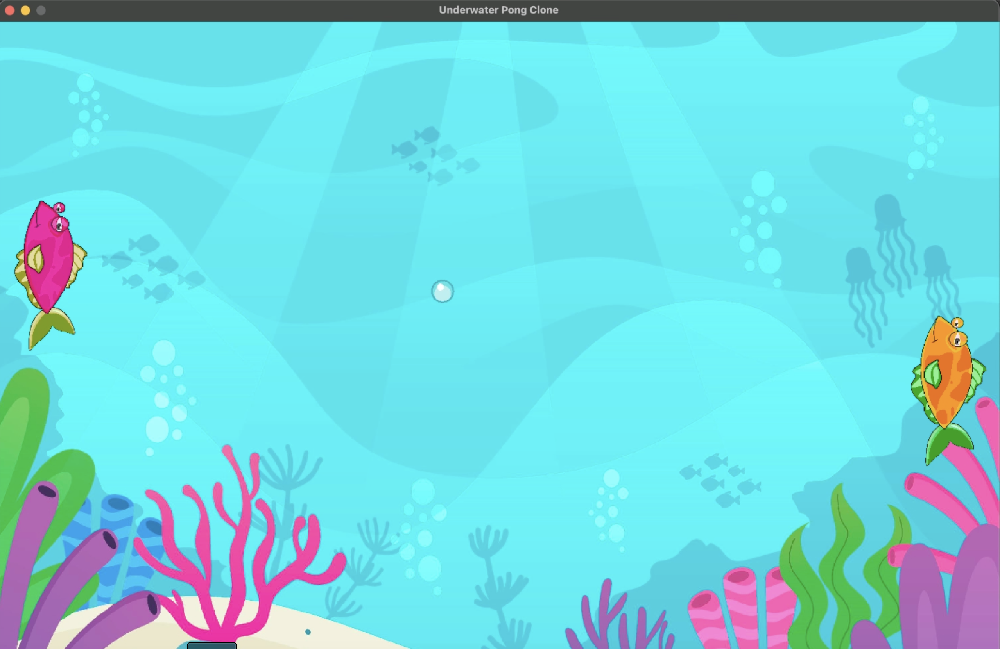

# Simple 2D Scene

## 📝 Project Overview

This project creates an interactive 2D scene using OpenGL featuring animated characters with various transformations including movement, rotation, and relative positioning. The scene showcases fundamental game programming concepts including delta time-based animations and texture mapping.

## ✨ Features

- **Multiple Textured Objects**: Two distinct characters with unique image textures
- **Dynamic Movement**: Characters animate with smooth translations
- **Rotation Effects**: Spinning animations for visual appeal
- **Relative Positioning**: Objects transform in relation to each other
- **Delta Time Animation**: Smooth, frame-rate independent movement

## 🎮 Scene Description

The scene features:
- **Gudetama** (lazy egg character) - floating and rotating with a dreamy animation
- **Stitch** - moving character with bounce animations
- **Blue gradient background** - creating a cheerful, sky-like atmosphere
- **Interactive elements** with smooth transitions and movements

## 🛠️ Technical Implementation

### Requirements Implemented
- ✅ **Two Textured Objects** - Gudetama and Stitch characters with unique sprites
- ✅ **Movement** - Both characters translate across the screen with smooth animations  
- ✅ **Rotation** - Gudetama rotates while floating through the scene
- ✅ **Relative Positioning** - Characters move in relation to each other creating dynamic interactions

### Technologies Used
- **OpenGL** for rendering
- **SDL2** for window management
- **C++** programming language
- **Texture mapping** for character sprites
- **Delta time** for smooth animations

## 🚀 How to Run

1. Clone this repository
2. Open `Simple2D.xcodeproj` in Xcode
3. Ensure you have the necessary OpenGL and SDL2 frameworks linked
4. Build and run the project in Xcode
5. The application will launch displaying the animated 2D scene

## 📂 Project Structure

```
Simple2DScene/
├── assets/              # Asset folder containing textures
│   ├── gudetama.png     # Gudetama character sprite (148 KB)
│   └── stitch.png       # Stitch character sprite (316 KB)
├── Simple2D/            # Source code folder
├── Simple2D.xcodeproj   # Xcode project file
└── README.md           # Project documentation
```

## 📸 Screenshots

The main scene shows both characters in a vibrant blue environment with smooth animations and engaging visual effects.



---------------------------------------------------------------

# Pong

A themed Pong clone set in an underwater world, featuring fish paddles and bubble balls for an immersive aquatic gaming experience.

## 🎮 Game Overview

This is a classic Pong game reimagined with an underwater theme. Players control fish paddles to hit a bubble ball back and forth in an aquatic environment. The game features both two-player and single-player modes with smooth animations and engaging underwater visuals.



## 🌊 Theme & Visuals

- **Fish Paddles**: Players control orange and pink fish instead of traditional rectangular paddles
- **Bubble Ball**: A floating underwater bubble serves as the game ball
- **Aquatic Environment**: Underwater-themed background and visual effects
- **Win Screens**: Custom victory displays when a player wins
- **Textured Objects**: All game elements feature detailed underwater-themed textures

## ✨ Features

### Core Gameplay
- **Two-Player Mode**: Both players can control their fish using keyboard inputs
  - Player 1: W/S keys for up/down movement
  - Player 2: Arrow keys (Up/Down) for movement
- **Single-Player Mode**: Press 'T' to toggle AI-controlled opponent with automatic up-and-down movement
- **Multi-Ball Mode**: Press number keys to control the number of bubbles in play
  - Press '2': Two bubbles active simultaneously
  - Press '3': Three bubbles active simultaneously
- **Ball Physics**: Bubbles bounce realistically off paddles and walls
- **Boundary Collision**: Fish paddles are constrained to screen boundaries
- **Game Over Detection**: Game ends when bubble reaches left or right screen edges with victory screen display

### Technical Implementation
- **Delta Time Animation**: Smooth, frame-rate independent movement
- **Box-to-Box Collision**: Reliable collision detection between all game objects
- **Textured Rendering**: All objects use custom underwater-themed textures
- **Keyboard Input Handling**: Responsive controls for both players

## 🎯 Gameplay Mechanics

1. **Paddle Movement**: Control your fish paddle to intercept the bubble
2. **Ball Bouncing**: Bubble bounces off top/bottom walls and fish paddles
3. **Scoring**: Game ends when bubble passes a player's fish
4. **Mode Switching**: Toggle between 2-player and 1-player modes anytime
5. **Collision Physics**: Realistic bounce mechanics for engaging gameplay

## 🚀 How to Play

1. **Start the Game**: Launch the application to begin
2. **Choose Mode**: 
   - Two-player: Both players control their fish
   - Single-player: Press 'T' to enable AI opponent
3. **Controls**:
   - Player 1 (Left Fish): W (up) / S (down)
   - Player 2 (Right Fish): Up Arrow / Down Arrow
   - Multi-Ball: 2 (two bubbles) / 3 (three bubbles)
4. **Objective**: Keep the bubbles from passing your fish paddle
5. **Win Condition**: Game ends when bubble reaches screen edge

## 🎬 Gameplay Video

[Watch Gameplay Demo](your-video-link-here)

## 🛠️ Technical Details

- **Graphics**: OpenGL rendering with texture mapping
- **Input**: SDL2 keyboard event handling
- **Physics**: Custom collision detection and movement systems
- **Animation**: Delta time-based smooth animations
- **Architecture**: Object-oriented design with separate paddle and ball entities

## 📂 Project Structure

```
2D-Games/
├── pong/                    # Pong game folder
│   ├── assets/              # Game textures and sprites
│   │   ├── orange.png       # Orange fish paddle
│   │   ├── pink.png         # Pink fish paddle
│   │   ├── bubble.png       # Bubble ball
│   │   ├── orange-wins.png  # Orange player victory screen
│   │   ├── pink-wins.png    # Pink player victory screen
│   │   ├── game-over.png    # Game over screen
│   │   └── underwater.jpg   # Background texture
│   ├── PongProject.xcodeproj # Xcode project file
│   ├── PongProject/         # Source code folder
│   └── README.md           # Game documentation
└── README.md               # Main project documentation
```

---

*An underwater twist on the classic Pong game*
