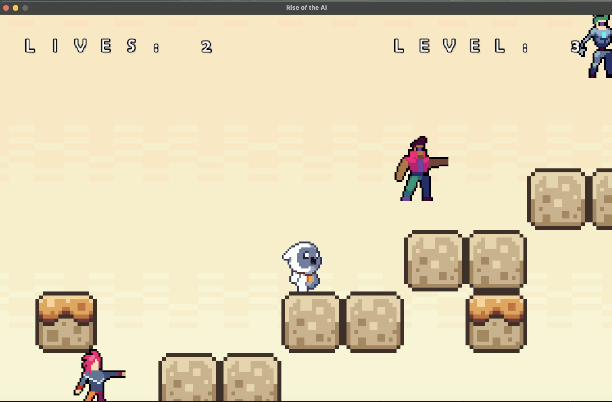

# Simple 2D Scene

## 📝 Project Overview

This project creates an interactive 2D scene using OpenGL featuring animated characters with various transformations including movement, rotation, and relative positioning. The scene showcases fundamental game programming concepts including delta time-based animations and texture mapping.

## ✨ Features

- **Multiple Textured Objects**: Two distinct characters with unique image textures
- **Dynamic Movement**: Characters animate with smooth translations
- **Rotation Effects**: Spinning animations for visual appeal
- **Relative Positioning**: Objects transform in relation to each other
- **Delta Time Animation**: Smooth, frame-rate independent movement

## 🎮 Scene Description

The scene features:
- **Gudetama** (lazy egg character) - floating and rotating with a dreamy animation
- **Stitch** - moving character with bounce animations
- **Blue gradient background** - creating a cheerful, sky-like atmosphere
- **Interactive elements** with smooth transitions and movements

## 🛠️ Technical Implementation

### Requirements Implemented
- ✅ **Two Textured Objects** - Gudetama and Stitch characters with unique sprites
- ✅ **Movement** - Both characters translate across the screen with smooth animations  
- ✅ **Rotation** - Gudetama rotates while floating through the scene
- ✅ **Relative Positioning** - Characters move in relation to each other creating dynamic interactions

### Technologies Used
- **OpenGL** for rendering
- **SDL2** for window management
- **C++** programming language
- **Texture mapping** for character sprites
- **Delta time** for smooth animations

## 🚀 How to Run

1. Clone this repository
2. Open `Simple2D.xcodeproj` in Xcode
3. Ensure you have the necessary OpenGL and SDL2 frameworks linked
4. Build and run the project in Xcode
5. The application will launch displaying the animated 2D scene

## 📂 Project Structure

```
Simple2DScene/
├── assets/              # Asset folder containing textures
│   ├── gudetama.png     # Gudetama character sprite (148 KB)
│   └── stitch.png       # Stitch character sprite (316 KB)
├── Simple2D/            # Source code folder
├── Simple2D.xcodeproj   # Xcode project file
└── README.md           # Project documentation
```

## 📸 Screenshots

The main scene shows both characters in a vibrant blue environment with smooth animations and engaging visual effects.


---------------------------------------------------------------

# Pong

A themed Pong clone set in an underwater world, featuring fish paddles and bubble balls for an immersive aquatic gaming experience.

## 🎮 Game Overview

This is a classic Pong game reimagined with an underwater theme. Players control fish paddles to hit a bubble ball back and forth in an aquatic environment. The game features both two-player and single-player modes with smooth animations and engaging underwater visuals.


## 🌊 Theme & Visuals

- **Fish Paddles**: Players control orange and pink fish instead of traditional rectangular paddles
- **Bubble Ball**: A floating underwater bubble serves as the game ball
- **Aquatic Environment**: Underwater-themed background and visual effects
- **Win Screens**: Custom victory displays when a player wins
- **Textured Objects**: All game elements feature detailed underwater-themed textures

## ✨ Features

### Core Gameplay
- **Two-Player Mode**: Both players can control their fish using keyboard inputs
  - Player 1: W/S keys for up/down movement
  - Player 2: Arrow keys (Up/Down) for movement
- **Single-Player Mode**: Press 'T' to toggle AI-controlled opponent with automatic up-and-down movement
- **Multi-Ball Mode**: Press number keys to control the number of bubbles in play
  - Press '2': Two bubbles active simultaneously
  - Press '3': Three bubbles active simultaneously
- **Ball Physics**: Bubbles bounce realistically off paddles and walls
- **Boundary Collision**: Fish paddles are constrained to screen boundaries
- **Game Over Detection**: Game ends when bubble reaches left or right screen edges with victory screen display

### Technical Implementation
- **Delta Time Animation**: Smooth, frame-rate independent movement
- **Box-to-Box Collision**: Reliable collision detection between all game objects
- **Textured Rendering**: All objects use custom underwater-themed textures
- **Keyboard Input Handling**: Responsive controls for both players

## 🎯 Gameplay Mechanics

1. **Paddle Movement**: Control your fish paddle to intercept the bubble
2. **Ball Bouncing**: Bubble bounces off top/bottom walls and fish paddles
3. **Scoring**: Game ends when bubble passes a player's fish
4. **Mode Switching**: Toggle between 2-player and 1-player modes anytime
5. **Collision Physics**: Realistic bounce mechanics for engaging gameplay

## 🚀 How to Run

1. **Clone the Repository**:
   ```bash
   git clone https://github.com/your-username/2D-Games.git
   cd 2D-Games/pong
   ```

2. **Open in Xcode**:
   - Open `PongProject.xcodeproj` in Xcode
   - Ensure you have the necessary OpenGL and SDL2 frameworks linked

3. **Build and Run**:
   - Press the "Play" button in Xcode or use Cmd+R
   - The game window will launch

4. **System Requirements**:
   - macOS with Xcode installed
   - OpenGL and SDL2 frameworks

## 🎮 How to Play

1. **Start the Game**: Launch the application to begin
2. **Choose Mode**: 
   - Two-player: Both players control their fish
   - Single-player: Press 'T' to enable AI opponent
3. **Controls**:
   - Player 1 (Left Fish): W (up) / S (down)
   - Player 2 (Right Fish): Up Arrow / Down Arrow
   - Multi-Ball: 2 (two bubbles) / 3 (three bubbles)
4. **Objective**: Keep the bubbles from passing your fish paddle
5. **Win Condition**: Game ends when bubble reaches screen edge

## 🎬 Gameplay Video

[Watch Gameplay Demo](https://github.com/user-attachments/assets/ab133e9e-93b6-41e1-b1ab-8e8a9b3d9037)

## 🛠️ Technical Details

- **Graphics**: OpenGL rendering with texture mapping
- **Input**: SDL2 keyboard event handling
- **Physics**: Custom collision detection and movement systems
- **Animation**: Delta time-based smooth animations
- **Architecture**: Object-oriented design with separate paddle and ball entities

## 📂 Project Structure

```
2D-Games/
├── pong/                    # Pong game folder
│   ├── assets/              # Game textures and sprites
│   │   ├── orange.png       # Orange fish paddle
│   │   ├── pink.png         # Pink fish paddle
│   │   ├── bubble.png       # Bubble ball
│   │   ├── orange-wins.png  # Orange player victory screen
│   │   ├── pink-wins.png    # Pink player victory screen
│   │   ├── game-over.png    # Game over screen
│   │   └── underwater.jpg   # Background texture
│   ├── PongProject.xcodeproj # Xcode project file
│   ├── PongProject/         # Source code folder
│   └── README.md           # Game documentation
└── README.md               # Main project documentation
```

----------------------------------------------------------

# Lunar Lander

A physics-based space landing game featuring realistic gravity simulation, fuel management, and precision piloting challenges.

## 🚀 Game Overview

This is a classic Lunar Lander game where players pilot a spacecraft through a challenging landing sequence. Navigate using thruster controls while managing limited fuel and fighting against gravity to achieve a successful landing on designated platforms.


## 🌌 Theme & Visuals

- **Space Environment**: Atmospheric space-themed background and terrain
- **Spacecraft**: Detailed player-controlled lander with thruster effects
- **Landing Platforms**: Strategic landing zones for mission completion
- **Realistic Physics**: Gravity and momentum simulation for authentic flight dynamics
- **Mission UI**: Clear feedback for mission status and fuel levels

## ✨ Features

### Core Gameplay
- **Physics-Based Movement**: Realistic gravity affects the spacecraft continuously
- **Acceleration Controls**: 
  - Left/Right arrow keys for horizontal thrust
  - Thruster input changes acceleration, not direct velocity
  - Momentum and drift mechanics for realistic space flight
- **Fuel Management**: Limited fuel supply that depletes with thruster use
- **Mission Objectives**: Land safely on designated platforms to win
- **Collision Detection**: Crash detection for failed landing attempts

### Technical Implementation
- **Entity Class System**: Object-oriented design with reusable entity components
- **Fixed Time Steps**: Consistent physics simulation regardless of frame rate
- **Delta Time Animation**: Smooth, frame-rate independent movement
- **Acceleration-Based Physics**: Realistic momentum and drift mechanics
- **State Management**: Game state tracking for win/loss conditions

## 🎯 Gameplay Mechanics

1. **Gravity Physics**: Spacecraft continuously falls due to simulated lunar gravity
2. **Thruster Control**: Use arrow keys to apply acceleration forces
3. **Momentum System**: Ship drifts when thrusters are released
4. **Fuel Consumption**: Each thruster activation consumes precious fuel
5. **Landing Challenge**: Touch down gently on landing platforms to succeed
6. **Mission Failure**: Crashing into terrain or obstacles ends the mission

## 🚀 How to Run

1. **Clone the Repository**:
   ```bash
   git clone https://github.com/your-username/2D-Games.git
   cd 2D-Games/lunar-lander
   ```

2. **Open in Xcode**:
   - Open `lunar-lander.xcodeproj` in Xcode
   - Ensure you have the necessary OpenGL and SDL2 frameworks linked

3. **Build and Run**:
   - Press the "Play" button in Xcode or use Cmd+R
   - The game window will launch

4. **System Requirements**:
   - macOS with Xcode installed
   - OpenGL and SDL2 frameworks

## 🎮 How to Play

1. **Start the Game**: Launch the application to begin your landing mission
2. **Controls**:
   - Left Arrow: Fire left thruster (move right)
   - Right Arrow: Fire right thruster (move left)
   - Monitor your fuel gauge carefully
3. **Objective**: 
   - Navigate to a landing platform
   - Land gently without crashing
   - Manage fuel consumption efficiently
4. **Win Condition**: Successfully touch down on a designated landing platform
5. **Lose Condition**: Crash into terrain or run out of fuel before landing

## 🎬 Gameplay Video

[Watch Gameplay Demo](https://github.com/user-attachments/assets/66276f9c-349b-4042-b8b4-82652b4c2a99)

## 🛠️ Technical Details

- **Graphics**: OpenGL rendering with texture mapping
- **Physics**: Custom gravity and acceleration systems
- **Input**: SDL2 keyboard event handling for thruster controls
- **Architecture**: Entity-based design with modular components
- **Collision**: Precise collision detection for landing and crash scenarios
- **Game Logic**: State machine for mission success/failure handling

## 📂 Project Structure

```
2D-Games/
├── lunar-lander/            # Lunar Lander game folder
│   ├── lunar-lander.png # Game screenshot
│   ├── assets/              # Game textures and sprites
│   │   ├── spacecraft.png   # Player ship sprite
│   │   ├── platform.png     # Landing platform texture
│   │   ├── background.png   # Space background
│   │   └── font.png         # UI text font
│   ├── lunar-lander.xcodeproj # Xcode project file
│   ├── lunar-lander/        # Source code folder
│   └── README.md           # Game documentation
└── README.md               # Main project documentation
```

## 🌟 Advanced Features

- **Fuel UI Display**: Real-time fuel gauge showing remaining thruster power
- **Moving Platforms**: Dynamic landing targets that add extra challenge
- **Physics Accuracy**: Realistic space flight simulation with momentum conservation

-------------------------------------------------------------------------------------

# Rise of the AI

A multi-level platformer adventure featuring intelligent AI enemies, scrolling environments, and challenging gameplay across three progressive levels.

## 🎮 Game Overview

Rise of the AI is a side-scrolling platformer where players navigate through three increasingly challenging levels while avoiding various types of AI enemies. With a classic lives system and progressive difficulty, players must use skill and strategy to complete their mission and reach the final victory.

## 🤖 Theme & Visuals

- **AI Enemies**: Multiple types of intelligent enemies with different movement patterns
- **Scrolling Levels**: Expansive side-scrolling environments to explore
- **Progressive Difficulty**: Each level introduces new challenges and obstacles
- **Dynamic Environments**: Varied platforming sections with unique layouts
- **Immersive Audio**: Background music and sound effects enhance the experience

## ✨ Features

### Core Gameplay
- **Menu System**: Welcome screen with game start functionality
- **Three Levels**: Progressive difficulty across multiple scrolling environments
- **Lives System**: Three lives across the entire game for added challenge
- **AI Opponents**: Multiple enemy types with distinct behaviors:
  - Guards with patrol patterns
  - Walkers with ground-based movement
  - Flyers with aerial navigation
- **Audio Experience**: Looping background music and interactive sound effects

### Technical Implementation
- **Scene Management**: Separate scene objects for menu and game levels
- **Entity System**: Robust entity-based architecture for all game objects
- **Map System**: Tilemap-based level design with collision detection
- **Fixed Time Steps**: Consistent physics and animation timing
- **Delta Time**: Smooth, frame-rate independent movement
- **Collision Detection**: Precise player-enemy and player-environment interactions

## 🎯 Gameplay Mechanics

1. **Platforming Movement**: Navigate through scrolling levels with jumping and movement
2. **AI Encounters**: Avoid different types of enemies with unique behaviors
3. **Lives Management**: Careful play required with limited three-life system
4. **Level Progression**: Complete three levels of increasing difficulty
5. **Victory/Defeat**: Clear endgame states for winning or losing
6. **Audio Feedback**: Sound effects for actions like jumping and collisions

## 🚀 How to Run

1. **Clone the Repository**:
   ```bash
   git clone https://github.com/your-username/2D-Games.git
   cd 2D-Games/rise-of-the-ai
   ```

2. **Open in Xcode**:
   - Open `SDLProject.xcodeproj` in Xcode
   - Ensure you have the necessary OpenGL and SDL2 frameworks linked

3. **Build and Run**:
   - Press the "Play" button in Xcode or use Cmd+R
   - The game window will launch with the menu screen

4. **System Requirements**:
   - macOS with Xcode installed
   - OpenGL and SDL2 frameworks

## 🎮 How to Play

1. **Start the Game**: Press Enter on the menu screen to begin
2. **Controls**:
   - Arrow Keys: Move left/right and jump
   - Navigate through scrolling levels
   - Avoid all AI enemies to survive
3. **Objective**: 
   - Complete all three levels without losing all lives
   - Avoid touching any AI enemies
   - Reach the end of the final level to win
4. **Lives System**: You have 3 lives for the entire game
5. **Win Condition**: Successfully complete all three levels
6. **Lose Condition**: Run out of lives by touching enemies

## 📸 Level Screenshots

### Level 1


### Level 2


### Level 3


## 🎬 Gameplay Video

[Watch Gameplay Demo](https://github.com/user-attachments/assets/a7fe182e-6265-4dfd-a23b-6f7bfed4cb07)

## 🛠️ Technical Details

- **Graphics**: OpenGL rendering with custom sprite assets
- **Audio**: SDL2 sound system with music and effect management
- **Physics**: Custom platformer physics with gravity and collision
- **AI Systems**: Multiple enemy behavior patterns and movement algorithms
- **Level Design**: Scrolling tilemap system with collision boundaries
- **Scene Management**: State-based scene transitions and management
- **Input Handling**: Responsive keyboard controls for movement and menu navigation

## 📂 Project Structure

```
2D-Games/
├── rise-of-the-ai/          # Rise of the AI game folder
│   ├── menu-screenshot.png  # Menu screen image
│   ├── lv1-platform.png # Level 1 gameplay image
│   ├── lv2-platform.png # Level 2 gameplay image
│   ├── lv3-platform.png # Level 3 gameplay image
│   ├── assets/              # Game assets (sprites, audio, maps)
│   ├── glm/                 # OpenGL Mathematics library
│   ├── shaders/             # GLSL shader files
│   ├── SDLProject.xcodeproj # Xcode project file
│   ├── SDLProject/          # Source code folder
│   │   ├── Entity.cpp/.h    # Entity class implementation
│   │   ├── Map.cpp/.h       # Tilemap system
│   │   ├── Scene.cpp/.h     # Scene management
│   │   ├── LevelA.cpp/.h    # Level A implementation
│   │   ├── LevelB.cpp/.h    # Level B implementation
│   │   ├── LevelC.cpp/.h    # Level C implementation
│   │   ├── Menu.cpp/.h      # Menu scene
│   │   └── [Additional game files...]
│   └── README.md           # Game documentation
└── README.md               # Main project documentation
```

## 🌟 Advanced Features

- **Multiple AI Types**: Each enemy type offers unique challenge patterns
- **Scrolling Environments**: Expansive levels that extend beyond single screens
- **Progressive Difficulty**: Thoughtfully designed level progression
- **Audio Integration**: Immersive sound design with music and effects
- **Lives Management**: Strategic gameplay with limited life system

------------------------------------------------------------------------


# Wizard Warrior

## 🧙 Game Overview

Wizard Warrior is a platform fighter where players control a powerful wizard battling through three levels of increasingly dangerous enemies. Using magical attacks and strategic positioning, players must defeat all AI opponents in each level to progress. The game features dynamic lighting systems and intense combat mechanics in a fantasy setting.

## ⚡ Theme & Visuals

- **Fantasy Combat**: Magical wizard protagonist with spell-casting abilities
- **Platform Fighting**: Combat-focused platformer with enemy engagement
- **Dynamic Lighting**: Spotlight system that can be toggled for atmospheric effects
- **Progressive Difficulty**: Each level introduces more challenging AI opponents
- **Magical Effects**: Spell-based attacks and visual effects enhance the combat experience

## ✨ Features

### Core Gameplay
- **Menu System**: Welcome screen with game start functionality
- **Three Combat Levels**: Progressive difficulty across multiple battle arenas
- **Platform Fighter Mechanics**: Combat-focused gameplay with attacking AI enemies
- **Magical Combat System**: Multiple attack directions using shift combinations
- **AI Opponents**: Intelligent enemies that attack when players get too close
- **Dynamic Lighting**: Toggleable spotlight system for atmospheric control
- **Audio Experience**: Immersive background music and combat sound effects

### Technical Implementation
- **Scene Management**: Separate scene objects for menu and combat levels
- **Entity System**: Robust entity-based architecture for all game objects
- **Map System**: Combat arena design with strategic positioning elements
- **Shader Logic**: Dynamic lighting effects with conditional shader programming
- **Fixed Time Steps**: Consistent physics and animation timing
- **Delta Time**: Smooth, frame-rate independent movement and combat
- **Collision Detection**: Precise player-enemy and spell-target interactions

## 🎯 Gameplay Mechanics

1. **Combat Movement**: Navigate platform arenas while engaging enemy AI
2. **Spell Casting**: Use directional attacks to defeat enemies from multiple angles
3. **AI Encounters**: Enemies actively pursue and attack the player when in range
4. **Level Progression**: Defeat all enemies in each level to advance
5. **Environmental Control**: Toggle spotlight effects for tactical advantage
6. **Victory Condition**: Clear all three levels by defeating every AI opponent

## 🚀 How to Run

1. **Clone the Repository**:
   ```bash
   git clone https://github.com/your-username/2D-Games.git
   cd 2D-Games/wizard-warrior
   ```

2. **Open in Xcode**:
   - Open `SDLProject.xcodeproj` in Xcode
   - Ensure you have the necessary OpenGL and SDL2 frameworks linked

3. **Build and Run**:
   - Press the "Play" button in Xcode or use Cmd+R
   - The game window will launch with the menu screen

4. **System Requirements**:
   - macOS with Xcode installed
   - OpenGL and SDL2 frameworks

## 🎮 How to Play

1. **Start the Game**: Press Enter on the menu screen to begin
2. **Controls**:
   - Arrow Keys: Move left/right and jump
   - Up + Right Shift: Cast spell upward
   - Down + Right Shift: Cast spell downward
   - Right Shift: Cast spell horizontally
   - L Key: Toggle spotlight on/off
3. **Objective**: 
   - Defeat all AI enemies in each level
   - Use magical attacks strategically to overcome opponents
   - Complete all three levels to win the game
4. **Combat Strategy**: Enemies attack when you get too close - maintain distance and use spells
5. **Win Condition**: Successfully defeat all enemies across all three levels
6. **Lose Condition**: Being defeated by enemy AI attacks

## 📸 Level Screenshots

### Level 1


### Level 2


### Level 3


## 🎬 Gameplay Video

[Watch Gameplay Demo](your-video-link-here)

## 🛠️ Technical Details

- **Graphics**: OpenGL rendering with custom fantasy-themed assets
- **Audio**: SDL2 sound system with magical combat effects and atmospheric music
- **Combat Physics**: Spell projectile systems with collision detection
- **AI Systems**: Proximity-based enemy behavior and attack patterns
- **Lighting System**: Dynamic spotlight effects with shader-based implementation
- **Scene Management**: State-based transitions between menu and combat levels
- **Input Handling**: Multi-key combination system for directional spell casting

## 📂 Project Structure

```
2D-Games/
├── wizard-warrior/          # Wizard Warrior game folder
│   ├── menu-screenshot.png  # Menu screen image
│   ├── level1-screenshot.png # Level 1 combat arena
│   ├── level2-screenshot.png # Level 2 combat arena
│   ├── level3-screenshot.png # Level 3 combat arena
│   ├── assets/              # Game assets (sprites, audio, effects)
│   ├── glm/                 # OpenGL Mathematics library
│   ├── shaders/             # GLSL shader files for lighting effects
│   ├── SDLProject.xcodeproj # Xcode project file
│   ├── SDLProject/          # Source code folder
│   │   ├── Effects.cpp/.h   # Special effects implementation
│   │   ├── Entity.cpp/.h    # Entity class implementation
│   │   ├── Map.cpp/.h       # Arena/level system
│   │   ├── Scene.cpp/.h     # Scene management
│   │   ├── LevelA.cpp/.h    # Combat Level A
│   │   ├── LevelB.cpp/.h    # Combat Level B
│   │   ├── LevelC.cpp/.h    # Combat Level C
│   │   ├── Menu.cpp/.h      # Menu scene
│   │   └── [Additional game files...]
│   └── README.md           # Game documentation
└── README.md               # Main project documentation
```

## 🌟 Advanced Features

- **Directional Combat**: Multi-directional spell casting system with combination controls
- **Intelligent AI**: Proximity-based enemy behavior that creates dynamic combat encounters
- **Dynamic Lighting**: Shader-based spotlight system that affects gameplay atmosphere
- **Platform Fighter Design**: Combat-focused level design optimized for magical battles

---


